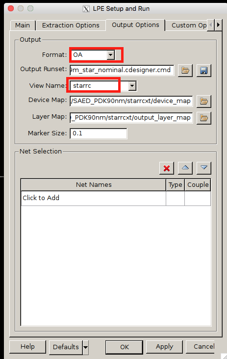

# Lab/Tutorial 3

In this tutorial, some contexts use Synopsys tutorials from Vazgen Melikyan (Synopsys) and Hamid Nahmoodi (SFSU). All the tools and PDK are given thru Synopsys University Program.

## Introduction

In this tutorial, you will learn how to do parasitic extraction/ post layout simulation and hierarchical design. You will use your Inverter design for your parasitic extraction and post layout simulation. For your hierarchical design, you will eventually design Ring Oscillator. You need to check off until Ring Oscillator.

This work design for two weeks lab, so for your lab report, you need to design 4-bit binary full adder schematic, layout (DRC,LVS pass) and post layout simulation, which requires Hierarchical Design skill. The 1-bit adder requires 5 nand gates.

## Part 9: Parasitic Extraction (continues from lab1 and lab2)

You need to keep working on Inverter schematic and layout for this extraction.

From your lab2, after passing DRC and LVS you can now move on to LPE (Layout Parasitic Extraction). In this phase, resistances and capacitances will be extracted from the layout. In layout window go to Verification -> LPE -> Setup and Run. Please make sure your setup the Fig. 66 for the Main tab.

_**Fig. 66. LPE Setup for StarRC**_

In Fig 66, you need to click the "View output" Option to see the output window.

_**Fig. 67-0. LPE Setup for StarRC**_

In Fig67, 'Extraction Options' tab, you need to your 'Runset Report File' to yours. It is located under `pvjob_[your library name]_[your cellview name].icv.lvs' folder.

_**Fig. 67-1. LPE Setup for StarRC**_

_**Fig. 67-2. LPE Setup for StarRC**_

_**Fig. 67-3. LPE Setup for StarRC**_

In Fig67-3, you should choose your ground node. You chose 'AVSS' for our ground. So put this.

_**Fig. 68. LPE Setup for StarRC**_

Make sure the other options in this tab match up with Fig 67-0,1,2,3, and Fig 68.

Now click on OK. Then you will see Customer Designer as Fig. 69.

_**Fig. 69. Console Output**_

After some time you should able to see the following message as shown in the console window if the parasitics were generated correctly. See Fig 70.

_**Fig. 70. Console Output**_

After LPE has successfully run, a parasitic view window should open. See Fig 71 and 72 for reference. The RC components are very small in the window that opens up (Fig 71) so you may need to zoom in to see the details (Fig 72). It may help to drag a box around the RC components using the mouse cursor to highlight them, then zoom in to see them. Also note that your parasitic view may not match exactly as shown below which is fine since this depends on differences in layout

_**Fig. 71. Parasitic View**_

_**Fig. 72. Parasitic View Zoom In**_

You have successfully generated the parasitic view for the inverter and are ready to run post layout simulation. Save the parasitic view with Design -> Save. The parasitic view will be saved as “starrc” for the view name.

## Part 10: Post Layout Simulation

## Part 11: Hierarchical Design - (Last tutorial)
